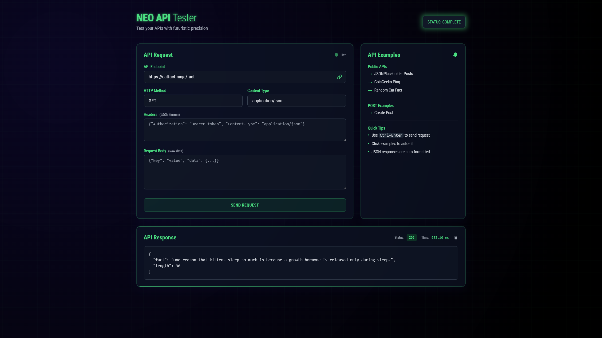

# 🚀 NEO API Tester

**NEO API Tester** is a lightweight, single-file web application for testing REST APIs with ease.  
It provides a clean and futuristic UI with instant feedback on status, response time, and formatted responses — all without installing any dependencies.

---

## ✨ Features
- **HTTP Methods**: Supports `GET`, `POST`, `PUT`, `DELETE`, and `PATCH`.
- **Custom Headers & Body**: Add your own headers (JSON format) and request body.
- **Response Insights**:
  - Status code with color indicators
  - Response time in milliseconds
  - Auto-formatted JSON or plain text
- **Copy to Clipboard**: Quickly copy the response content.
- **Examples Included**:
  - JSONPlaceholder (Posts API)
  - CoinGecko (Ping)
  - CatFact (Random fact API)
- **Modern UI**:
  - Glassmorphism + neon design
  - Animated status indicators
  - Responsive and mobile-friendly

---

## 🛠 How to Use
1. Clone this repository or download the file:
   ```bash
   git clone https://github.com/your-username/neo-api-tester.git
   ```
2. Open `Neo.html` in any modern browser (no server required).
3. Enter your API endpoint.
4. Select method, content type, headers, and body as needed.
5. Click **Send Request** (or press `Ctrl + Enter`) to get the response.

---

## ⚡ Shortcuts
- `Ctrl + Enter` → Send request instantly.
- Click on **API Examples** → Auto-fills the request form for quick testing.

---

## 📂 Project Structure
```
neo-api-tester/
│
├── Neo.html    # Main single-file app (HTML, CSS, JS in one file)
```

---

## 📸 Screenshots

*(Optional: Add screenshots of your UI here. For example:)*  


---

## 📜 License
This project is licensed under the **MIT License** – feel free to use, modify, and distribute.

---

## 💡 Future Improvements
- Save request history (local storage).
- Dark/light theme toggle.
- Export/import requests as JSON.
- Support for GraphQL queries.
